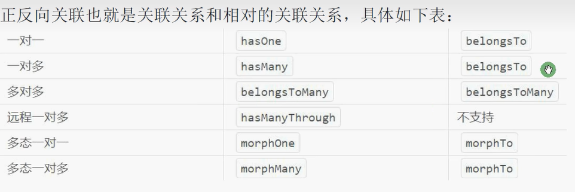

# ThinkPHP基础

> Author: Sylvie233
>
> Date: 23/1/28
>
> Point: 

[TOC]

## 基础介绍

### 项目目录

```
thinkphp:
	/app:
		/controller:
			Error.php:
			index.php:
		/facade:
		/lang:
		/model:
		.htaccess:
		BaseController.php:
		common.php:
		event.php:
		ExceptionHandle.php:
		middleware.php:
		provider.php:
		Request.php:
		service.php:
	/config:
		app.php:
		cache.php:
		console.php:
		cookie.php:
		database.php:
		filesystem.php:
		lang.php:
		log.php:
		middleware.php:
		route.php:
		session.php:
		trace.php:
		view.php:
	/extend:
	/public:
		/static:
		.htaccess:
		favicon.ico:
		index.php:
		robots.txt:
		router.php:
	/route:
		app.php: 路由定义
	/runtime:
		/cache: 
		/log:
		/schema:
		/session:
		/storage:
		/temp:
		.gitignore
	/vendor:
	/view:
	.example.env:
	travis.yml:
	composer.json:
	think:
```


#### .example.env

```
APP_DEBUG = true
```


#### app/event.php

```
[
	bind => [],
	listen => [
	
	],
	subscribe => []
]
```


#### app/middleware.php

```
[
	\think\middleware\CheckRequestCache::class,
	\think\middleware\LOadLangPack::class,
	\think\middleware\SessionInit::class
]
```


#### app/provider.php

```
[
	'think\Requset' => Requset::class,
	'think\exception\Handle' => ExceptionHandle::class
]
```


#### config/app.php

```
[
	with_route => true 						// 启用路由
]
```


#### config/cache.php

```
[
	default =>,
	stores => [
		file => [
			type => "File",
			path,
			prefix,
			expire,
			tag_prefix,
			serialize,
		]
	]
]
```


#### config/cookie.php

```
[
	expire => 0,
]
```


#### config/database.php

```
[
	auto_timestamp => true
	connections => [
		mysql => [
			fields_cache:
			schema_cache_path:
		]
	]
]
```


#### config/filesystem.php

```
[
	default:
	disks => [
		local => [
			type,
			root,
		],
		public => [
			type,
			root,
			url,
			visibility,
		]
	]
]
```


#### config/lang.php

```
[
	default_lang,
	allow_lang_list,
	detect_var,
	accept_language,
]
```


#### config/log.php

```
[
	file => [
		type => "File",
		paht,
		single,
		apart_level,
		max_files,
		json,
		format,
	]
]
```


#### config/route.php

```
[
	url_route_must => true // 强制使用路由规则
]
```


#### config/view.php

```
[
	type => "Think",
	view_dir_name => "view",
	view_suffix => "html"
]
```


### think

```
php think:
	make:
		controller:
		event:
		listener:
		middleware:
		service:
		subscribe:
		validate:
	optimize:
		schema:
	run:
```


## 核心内容

### 控制器


### 模型

事件机制

模型关联




关联预载入


### 路由

路由定义：`route/app.php`

```
// 定义路由
Route::get(xxx, function () {})


```


### Facade门面

依赖注入

```
助手:
	app():
	batch():
	bind():
    check():
	code():
	header():
	input():
	json():
	redirect():
	remember():
	response():
	restore():
	session():
	url():
	validate(): 验证
	view(): 模板
	with():
```


手动注入

```
bind(): 注入
app(): 获取注入对象
```


provider.php预注入


### 验证器

自定义规则

注解验证


### 模板

view目录


模板语法：

```
{$xxx}
{$xxx->xxx}
{$xxx::xxx}

{/* 注释 */}

{$xxx | default="xxx"}
	date:
	default:
	format:
	md5:
	raw:
	upper:
	
{:php函数()}

{assign name value}
{define name value}

{foreach $list as $k=>$v}
{/foreach}

{volist name="list" id="obj" offset length}
{/volist}

{for start end name step comparison}
	{$i}
{/for}

{eq name="xxx" value="xxx"}
{else}
{/eq}

{switch}
	{case}{/case}
	{default/}
{/switch}

{if OR}
{elseif}
{else}
{/if}

{in name value}
{else}
{/in}

{between name value}
{/between}

{present name}
{else}
{/present}


{
	$Request:
}
{
	$Think:
		config:
		lang:
}


{include file}
	[xxx]
{load href}
{js href}
{css href}

{__CONTENT__}
{layout name replace}

{block name}
{/block}
{extend name}
```


### 中间件

SessionInit


注册中间件


```
中间件:
	handle($request, \Closure $next):
```


### 插件

#### think/think-captcha

验证码


#### think/think-image


#### topthink/think-multi-app


## API(think)

```
think:
	App:
	Cache:
	Config:
	Cookie:
	COnsole:
	Db:
	Debug:
	Env:
	Event:
	Http:
	Lang:
	Log:
	Middleware:
	Response:
	Filesystem:
	Route:
	Session:
	View:
```


### Facade

```
think\Facade:
	getFacadeClass():
```


### Model

```
think\Model:
	SoftDelete: 软删除
    autoWriteTimestamp:
	connection: 设置连接
	createTime:
	deleteTime:
	disuse:
	globalScope: [全局查询范围]
	json:
	name: 表名
	pk: 主键
	readonly: []
	schema: []
	strict:
	table:
	type: []
	updatetTime:
	chunk():
	create():
	column():
	cursor():
	destroy():
	field():
	find():
		getAttr():
	findOrEmpty():
	getByXxx():
	getData():
	getXxx():
	getNothingAttr():
	getXxxAttr(): 模型获取器
	hasWhere():
	init(): 初始化
	limit():
	max():
	onAfterRead():
	onAfterUpdate():
	onBeforeUpdate():
	onlyTrashed():
	order():
	paginate():
	scopeXxx(): 模型查询范围（查询条件封装）
	searchXxxAttr(): 模型搜索器
	select():
	setXxxAttr(): 模型修改器
	update():
	value():
	where():
	whereIn():
	with():
	WithAttr(): 动态获取器
	withAvg():
	withCount():
	withMax():
	withMin():
	withoutGlobalScope():
	withSearch():
	withSum():
	withTrashed():
	xxx模型(): 设置模型关联
		hasOne():
		belongsTo():
		hasOneThrough():
		hasMany():
		hasManyThrough():
		belongsToMany():
		morphOne():
		morphTo():
		morphMany():
	---
	allowField():
	append():
	attach():
	delete():
	detach():
	force():
	hidden():
	isEmpty():
	load():
	readonly():
	replace():
	restore():
	save():
	saveAll():
	together():
	visible():
	withAttr():
```


### Request

```
think\Request:
	filter:
	varMethod:
	action():
	checkToken():
	controller():
	except():
	has():
	header():
	isAjax():
	isGet():
	isPost():
	method():
	only():
	param():
	root():
	route():
	url():
```


### Validate

```
think\Validate:
	message:
	rule:
		after:
		between:
		chs:
		confirm:
		email:
		eq:
		file:
		fileExt:
		length:
		max:
		number:
		regex:
		require:
		requireWith:
		unique:
	scene: 场景验证
		insert:
	append():
	only():
	remove():
	sceneXxx():
```


### annotation

#### Route

```
@route:
	
```


##### Resource

```
@Resource:
```


#### route

##### Group

```
@Group:
	
```


##### Validate

```
@Validate():
```


### exception

#### Handle

#### ValidateException


### facade

#### Cache

```
think\facade\Cache:
	clear():
	dec():
	delete():
	get():
	has():
	inc():
	pull():
	push():
	remember():
	set():
	tag():
```


#### Config

```
think\facade\Config:
	get():
```


#### Cookie

```
think\facade\Cookie:
	delete():
	forever():
	get():
	has():
	set():
```


#### Db

```
think\facade\Db:
	connect():
	event():
		before_select:
		after_update:
	execute():
	getLastSql():
	json():
	name():
	query():
	raw():
	startTrans():
	table():
		Collection:
			pop():
			shuffle():
            toArray():
            whereIn():
		Query:
			alias():
			avg():
			buildSql():
            chunk():
            cursor():
            column():
            count():
            dec():
            delete():
            exp():
            fetchSql():
            field():
            fieldRaw():
            find():
            findOrEmpty():
            getFieldByXXX():
            group():
            having():
            inc():
            insert():
            insertAll():
            limit():
            max():
            min():
            order():
            orderRaw():
            page():
            removeOption():
            replace():
            save():
            select():
            selectOrFail():
            strict():
            sum():
            update():
            value():
            where():
            whereBetween():
            whereBetweenTime():
            whereBetweenTimeField():
            whereColumn():
            whereExp():
            whereLike():
            whereNotBetween():
            whereNotLike():
            whereNull():
            whereOr():
            whereRaw():
            whereTime():
            whereYear():
            whereXXX():
            when():
            withAttr():
            withoutField():
	transaction():
```


#### Env

```
think\facade\Env:
	get():
	has():
```


#### Filesystem

```
think\facade\Filesystem:
	putfile():
```


#### Lang

```
think\facade\Lang:
	get():
```


#### Request

```
think\facade\Request:
	cookie():
	file():
	session():
```


#### Route

```
think\facade\Route:
	ajax():
	allowCrossDomain():
	append():
	buildUrl():
	cache():
	denyExt():
	domain():
	except():
	ext():
	filter():
	get():
	group(): 路由分组
	https():
	miss():
	name():
	only():
	option():
	pattern():
	post():
	prefix():
	redirect():
	resource(): 
	rest():
	rule():
	suffix():
	validate():
	vars():
```


#### Session

```
think\facade\Session:
	all():
	clear():
	delete():
	flash():
	get():
	has():
	pull():
	set():
```


#### Validate

```
think\facade\Validate:
	batch():
	between(:)
	check():
	checkRule():
	getError():
	isEmail():
	isRequire():
	max():
	message():
	must():
	rule():
	scene():
```


#### View

```
think\facade\View:
	assign():
	config():
	engine():
	fetch():
	filter():
```


### middleware

#### CheckRequestCache

```
think\middleware\CheckRequestCache:
	
```


### model

#### Pivot

多对多关联中间表模型

```
think\model\Pivot:
	
```

